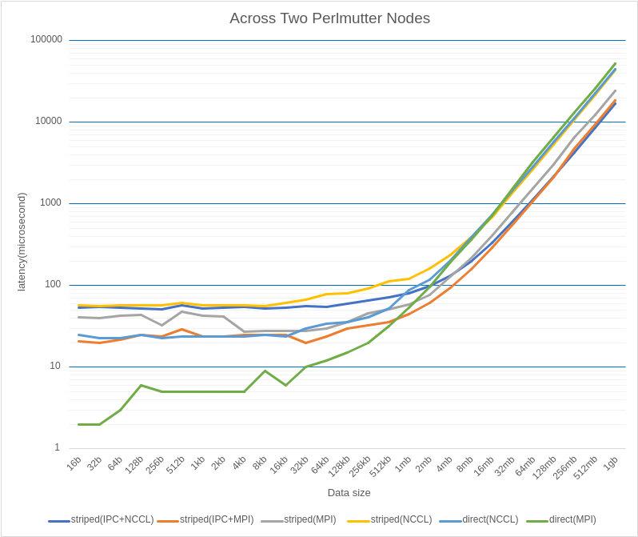
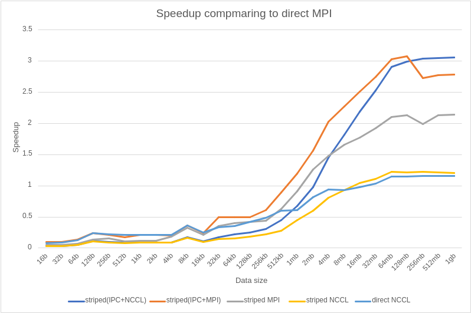
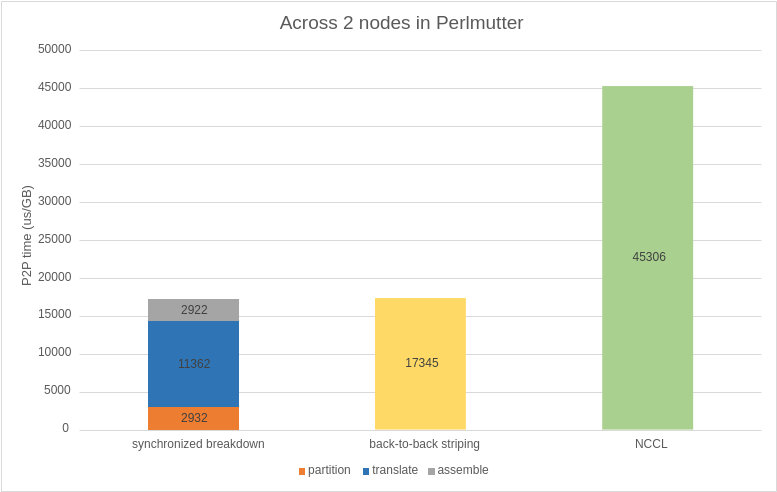

## Striping Example

### High-level Goal

This example uses multi-rail striping algorithm to perform point-to-point GPU communication between 2 GPUs on different nodes. Each node consists of 4 GPUs, which are logically binded to 4 NICs in a one-to-one manner, respectively. A direct P2P GPU communication would only utilize 1 NIC's bandwidth while there are 4 NICs available. We first partition data into 4 chunks and transfer each chunk to a GPU at the transmitter node. Then we send data through each GPUs and their corresponding NICs, and finally assemble data at the receiver node. In this way, we maximixe the point-to-point bandwidth in multi-rail network by using all the NICs across nodes.

### Code Explanation

We declare three communicator to achieve the goal described above:
```cpp
Comm<int> partition(IPC);
Comm<int> translate(NCCL);
Comm<int> assemble(IPC);
```
``IPC`` is the communication mechanism we used for intra-node communication. ``NCCL`` is used for inter-node communication. The choice of communication method is optimized for this example on Perlmutter. ``MPI`` is also available for both intra-node and inter-node communication. The optimization is shown in later section.

We use ``add`` function to register data transfer events for each communicator. As we explained in High-level Goal, ``partition`` and ``assemble`` is responsible for intra-node communication at the transmitter and receiver node respectively, and ``translate`` is responsible for inter-node communication using 4 NICs' bandwidth.

After registering events, we use ``measure`` function to run the events back-to-back and measuring the latency (performance) at the same time.

### Optimization 







The above pictures shows the optimization result. We have tried different combinations of communication libraries among three communicator (IPC only works for intra-node communication), and we found ``IPC`` + ``NCCL`` has the best performance when data size is large. When data size is small, ``direct MPI`` has the best performance. The comparison graph shows the sum of stepwise latency is higher than running the back-to-back striping measurement since each GPU only waits if there is any dependency from another GPU in the asynchronous communications.


